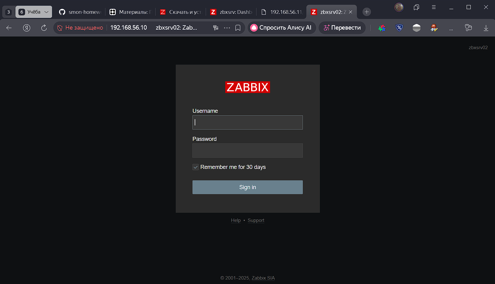
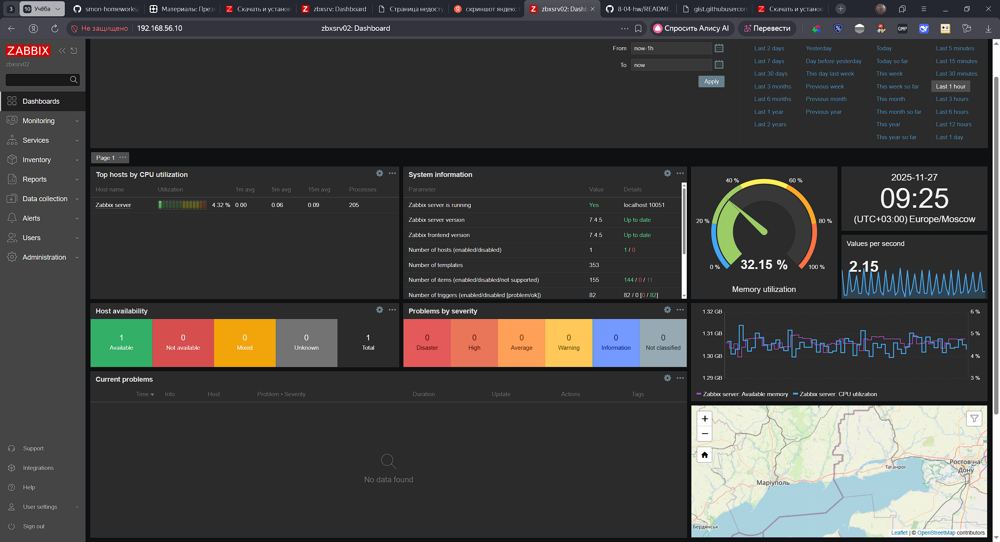

# Домашнее задание к занятию "`Система мониторинга Zabbix`" - `Моторин Алексей`

---

### Задание 1
1. Cкриншот авторизации в админке и стартовый дашбоард Zabbix.

Скриншот-1 к заданию 1 (Cкриншот авторизации в админке):


Скриншот-2 к заданию 1 (Стартовый дашбоард Zabbix):


2. Текст использованных команд и конфигурация Zabix Server.

[Конфигурация: Zabbix 7.4 (Server, Frontend, Agent), Debian 13 Trixie, PostgreSQL 17.6, Apache 2](https://www.zabbix.com/ru/download?zabbix=7.4&os_distribution=debian&os_version=13&components=server_frontend_agent&db=pgsql&ws=apache)

`Установка Zabbix 7.4 (Server, Frontend, Agent) под root Debian 13`

```bash
# 1. Установка PostgreSQL
apt install postgresql

# 2. Настроить аутентификацию в PostgreSQL
nano /etc/postgresql/*/main/pg_hba.conf
# Меняем опцию на md5
# TYPE  DATABASE        USER            ADDRESS                 METHOD
# local   all             all                                     md5

# 3. Перезапуск PostgreSQL
systemctl reload postgresql

# 4. Установка репозитория Zabbix
wget https://repo.zabbix.com/zabbix/7.4/release/debian/pool/main/z/zabbix-release/zabbix-release_latest_7.4+debian13_all.deb
dpkg -i zabbix-release_latest_7.4+debian13_all.deb
apt update

# 5. Установка Zabbix сервера, веб-интерфейса и агента
apt install zabbix-server-pgsql zabbix-frontend-php php8.4-pgsql zabbix-apache-conf zabbix-sql-scripts zabbix-agent
 
# 6. Задаём пользователя и БД через интерактивную сессию postgres
su - postgres
createuser --pwprompt zabbix
createdb -O zabbix zabbix
exit

# 7. Импорт начальной схемы и данных
zcat /usr/share/zabbix/sql-scripts/postgresql/server.sql.gz | psql -U zabbix -W zabbix

# 8. Настройка конфига Zabbix
nano /etc/zabbix/zabbix_server.conf
# DBPassword=zabbix

# 9. Запускаем процессы Zabbix сервера и агента, настраиваем их запуск при загрузке ОС.
systemctl restart zabbix-server zabbix-agent apache2
systemctl enable zabbix-server zabbix-agent apache2

# 10. Открываем Zabbix UI web интерфейс и следуем подсказкам мастера установки, завершаем установку.
```
`Команды Git (PowerShell)`

```powershell
# Перейти в нужный каталог
cd E:\

# Создать папку 005, если её нет
New-Item -ItemType Directory -Path "E:\005" -Force

# Клонируем репозиторий
git clone https://github.com/presdes/8-04-hw.git

# Переходим в каталог с репозиторием
cd E:\005\8-04-hw

# Проверяем статус репозитория
git status

# Сделать необходимые изменения в файлах
# ...

# Добавляем изменения в индекс
git add .

# Создаём коммит
git commit -m "h/w zabbix ч.1, версия 1"

# Отправляем изменения на удалённый репозиторий
git push origin main
```

---

### Задание 2

`Приведите ответ в свободной форме........`

1. `Заполните здесь этапы выполнения, если требуется ....`
2. `Заполните здесь этапы выполнения, если требуется ....`
3. `Заполните здесь этапы выполнения, если требуется ....`
4. `Заполните здесь этапы выполнения, если требуется ....`
5. `Заполните здесь этапы выполнения, если требуется ....`
6. 

```
Поле для вставки кода...
....
....
....
....
```

`При необходимости прикрепитe сюда скриншоты
`


---

### Задание 3

`Приведите ответ в свободной форме........`

1. `Заполните здесь этапы выполнения, если требуется ....`
2. `Заполните здесь этапы выполнения, если требуется ....`
3. `Заполните здесь этапы выполнения, если требуется ....`
4. `Заполните здесь этапы выполнения, если требуется ....`
5. `Заполните здесь этапы выполнения, если требуется ....`
6. 

```
Поле для вставки кода...
....
....
....
....
```

`При необходимости прикрепитe сюда скриншоты
`
